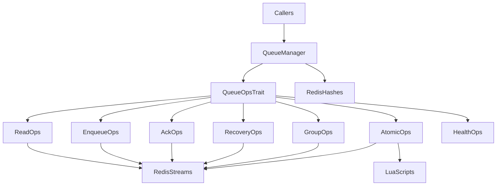

# scicomp-rq

`scicomp-rq` is a Redis Streams queue engine for scientific computing pipelines.
It provides typed message contracts, trait-based operation boundaries, and atomic
handoff/fan-out primitives for multi-stage workflows.

## What This Crate Provides

- Redis Streams queue operations (`XADD`, `XREADGROUP`, `XACK`, `XAUTOCLAIM`)
- Atomic stage handoff and fan-out via Lua scripts
- Typed stream/message contracts (`StreamKey`, `LogicalStreamName`, `Message`, `Output`)
- Trait-based API surface for testability and integration
- Optional Python bindings via `pyo3`

## Architecture Overview



## Quick Start (Rust)

```rust,no_run
use scicomp_rq::{LogicalStreamName, QueueManager, StreamKey};

# async fn example() -> scicomp_rq::Result<()> {
let qm = QueueManager::from_redis_url("redis://127.0.0.1:6379").await?;
let stream_key = StreamKey::new("prefetch");
qm.create_consumer_group(&stream_key, "prefetch:grp", "$", true).await?;

let logical_stream = LogicalStreamName::new("prefetch");
let message_id = qm
    .enqueue(&logical_stream, "run-001", "{\"model\":\"pangu\"}", "prefetch")
    .await?;

let messages = qm
    .read_messages(&stream_key, "prefetch:grp", "worker-1", 10, 1000)
    .await?;

for msg in messages {
    qm.ack_message(&msg).await?;
}

println!("Enqueued message: {}", message_id);
# Ok(())
# }
```

## Quick Start (Python)

```python
import asyncio
import scicomp_rq

async def main() -> None:
    qm = await scicomp_rq.QueueManager.from_redis_url("redis://127.0.0.1:6379")
    await qm.create_consumer_group("prefetch", "prefetch:grp", "$", True)

    msg_id = await qm.enqueue(
        stream_name="prefetch",
        run_id="run-001",
        payload='{"model":"pangu"}',
        stage="prefetch",
    )
    print("Enqueued:", msg_id)

asyncio.run(main())
```

## Configuration Reference

`QueueManager` construction:

- `QueueManager::from_redis_url(url)` - explicit Redis URL
- `QueueManager::from_env()` - reads `REDIS_URL`, defaults only when missing
- `QueueManager::new(url)` - explicit Redis URL
- `QueueManager::new_with_connection_config(url, config)` - explicit URL + Redis connection tuning
- `QueueManager::builder()` - fluent construction with optional script preloading and connection tuning

Runtime behavior notes:

- `ensure_groups()` has been removed; use explicit `create_consumer_group(...)`.
- Prefer explicit provisioning via `create_consumer_group(...)`.
- `enqueue(LogicalStreamName, ...)` requires logical stream names without `:`.
- `enqueue_to_stream(&StreamKey, ...)` is an advanced API/escape hatch for explicit
  stream-key usage when logical-name validation is intentionally bypassed.

## Trait Overview

| Trait | Responsibility |
|---|---|
| `ReadOps` | Read messages from consumer groups |
| `EnqueueOps` | Enqueue messages into logical streams |
| `AckOps` | Acknowledge processed messages |
| `AtomicOps` | Atomic handoff and fan-out operations |
| `RecoveryOps` | Claim/recover idle pending messages |
| `GroupOps` | Ensure/create consumer groups |
| `HealthOps` | Redis health diagnostics |
| `QueueOps` | Composite trait of all queue contracts |

Trait dispatch contract:

- Traits are currently designed for static dispatch (`T: QueueOps`) rather than
  object-safe dynamic dispatch (`dyn QueueOps`).
- With `async fn` in traits, futures from generic calls on `T: QueueOps` are
  not guaranteed `Send`; this trait path is intended for in-task orchestration.
- If you need `tokio::spawn`, prefer a concrete call path where the future is
  known `Send` (for example, direct `QueueManager` method calls).

## Feature Flags

- `python` - enables PyO3-based Python bindings

## Minimum Supported Rust Version

- MSRV: Rust `1.87` (required for let-chains used in parser and Lua helper paths).

## Python Feature Validation

Supported validation path (PR-146 Option B):

1. `cargo check -p scicomp-rq --features python`
2. `python -m maturin develop --manifest-path Cargo.toml --features python-extension`
3. `python -m pytest tests/test_scicomp_rq.py -q --run-integration`

Use the reproducible gate script from repository root:

```bash
bash ./platform/inference_rust/scripts/scicomp_rq_python_feature_gate.sh
```

Environment requirements:

- Python 3.11+ with `maturin`, `pytest`, `pytest-asyncio`
- reachable Redis instance (`REDIS_URL`, default `redis://127.0.0.1:6379`)

`cargo test -p scicomp-rq --features python` validates Rust-side Python bindings
without requiring extension-module linkage.

## Development Checks

```bash
cargo fmt --check
cargo clippy -p scicomp-rq --all-targets -- -D warnings
cargo test -p scicomp-rq --lib
cargo test -p scicomp-rq --doc
bash ./platform/inference_rust/scripts/scicomp_rq_python_feature_gate.sh
```

