# Prepare API Redesign

## Status

Draft for design review. This document proposes an author-facing `prepare()` API,
but it does not define the full implementation plan.

## Decision Summary

We should hide the current raw `ctx` envelope from plugin authors, but we should
not hide context entirely.

The recommended contract is:

```python
def prepare(self, request: RawRequest, ctx: PrepareContext) -> PrepareResult:
    ...
```

Where:

- `request` holds raw ingress data
- `ctx` holds a small typed prepare-time context
- `PrepareResult` holds normalized execution inputs plus runtime hints

This is the best balance of:

- simple plugin-author UX
- support for multipart and prepare-time artifact creation
- support for `resource_profile`, `batch_profile`, `fanout`, and `prefetch_plan`
- compatibility with the existing runtime

## What Problem Are We Solving?

Today `prepare()` takes one mixed dict and returns a flat dict patch:

```python
def prepare(self, ctx):
    params = dict(ctx["parameters"])
    ...
    return {
        "parameters": {
            "model": model,
            "device_kind": requested_device,
            "start_time": start_time,
            "nsteps": nsteps,
        },
        "resource_profile": _resource_profile(requested_device),
        "prefetch_plan": [],
    }
```

This is hard to reason about because:

- `ctx` mixes raw request data, normalized execution data, runtime metadata,
service handles, and internal envelope details.
- `parameters` means two different things: raw user fields before `prepare()`,
then normalized execution inputs after `prepare()`.
- prepare-time orchestration hints are flattened into the same return object as
user input normalization.
- plugin authors need some context during `prepare()`, but the current dict
exposes far more than they should need.

## Design Goals

- Make the author-facing boundary obvious from names alone.
- Keep raw ingress data separate from normalized execution inputs.
- Allow prepare-time artifact creation without requiring authors to know the full
runtime envelope.
- Keep dynamic runtime hints explicit and structured.
- Preserve compatibility with the current Rust/Python runtime while the public
API improves.

## Non-Goals

- Redesign every later hook in this document.
- Replace the internal run envelope in one step.
- Add a brand-new artifact publishing system for prepare-time files.
- Fully type every existing internal payload field before the public contract is
settled.

## Current Runtime Constraints

The current implementation matters because any design has to fit it.

- The runtime currently builds a large mixed context object in
`scripts/plugin_runtime.py`.
- The prepare stage only merges a fixed set of output keys in
`crates/worker-runtime/src/roles/prepare.rs`.
- Existing plugins already use `run_id` plus filesystem paths to do parent-side
precompute, especially for fanout.
- Existing plugins and docs still treat `parameters` as the transport field for
normalized execution data.

That means the public design should change the author experience first, then map
back to the existing envelope during migration.

## Four Best Options

### 1. Keep `prepare(ctx)` and only add typing

Shape:

```python
def prepare(self, ctx: PrepareEnvelope) -> PrepareEnvelopePatch:
    ...
```

Strengths:

- lowest implementation cost
- almost zero runtime migration risk
- easy to land incrementally

Weaknesses:

- preserves the core UX problem
- still exposes too much internal envelope detail
- keeps `parameters` ambiguous
- does not answer whether context should be hidden from authors

Verdict:

Good as a temporary annotation pass, not as the long-term API.

### 2. Remove context completely

Shape:

```python
def prepare(self, request: RawRequest) -> PrepareResult:
    ...
```

Strengths:

- smallest possible mental model
- raw request handling becomes very obvious
- ideal for simple JSON normalization

Weaknesses:

- too weak for real prepare workflows
- no clean place to expose `run_id` or a run-scoped directory for prepare-time
files
- awkward for fanout parent precompute and other prepare-time artifact creation
- awkward when runtime hints depend on manifest defaults or safe service/config
access

Verdict:

Attractive on paper, but too limiting for the actual plugin patterns already in
this repo.

### 3. Use `prepare(request, ctx) -> PrepareResult` with a narrow public `PrepareContext`

Shape:

```python
def prepare(self, request: RawRequest, ctx: PrepareContext) -> PrepareResult:
    ...
```

Strengths:

- clean separation between raw ingress, framework context, and normalized inputs
- still supports multipart, prepare-time files, and scheduling hints
- lets us hide the raw envelope dict while keeping the useful parts
- maps well onto the current runtime with a translation layer

Weaknesses:

- requires some new SDK surface area
- the exact contents of `PrepareContext` must be curated carefully
- still needs a compatibility layer because the runtime currently expects flat
prepare output keys

Verdict:

Best balance of UX, capability, and migration cost. Recommended.

### 4. Replace `ctx` with a builder or capability session object

Shape:

```python
def prepare(self, request: RawRequest, plan: PrepareSession) -> PreparedInputs:
    ...
```

Where `plan` would expose methods such as:

- `plan.set_resource_profile(...)`
- `plan.set_batch_profile(...)`
- `plan.set_fanout(...)`
- `plan.run_dir`
- `plan.write_artifact(...)`

Strengths:

- potentially the most ergonomic surface
- hides nearly all transport details
- can guide authors toward the intended workflow

Weaknesses:

- biggest implementation cost
- more magical and less explicit than returning a value object
- harder to serialize, inspect, and test
- larger departure from the current runtime model than we need right now

Verdict:

Worth keeping in mind as a future refinement, but too much change for this
redesign.

## Decision

We should hide the current raw `ctx` dict, but we should not hide context
entirely.

The best author-facing API is:

```python
def prepare(self, request: RawRequest, ctx: PrepareContext) -> PrepareResult:
    ...
```

The key design principle is:

- `request` is for user-supplied ingress data
- `ctx` is for framework-owned prepare-time metadata and safe capabilities
- `PrepareResult` is for normalized execution inputs plus runtime hints

In other words, hide the envelope, not the concept of context.

## Recommended Model Roles

To keep request schema hygiene clean, the SDK should distinguish between ingress
and execution models.

- `request_model` or `form_model`
  - public request contract
  - used for ingress validation and schema generation
- `input_model`
  - normalized execution contract for `run(inputs, ctx)`
  - may include fields that are derived during `prepare()`

Compatibility rule:

- if `request_model` is not defined for a JSON plugin, the SDK can treat
`input_model` as both ingress and execution model for simple cases

This is already close to how multipart plugins work today:

- `form_model` describes user form fields
- `input_model` describes the post-prepare execution payload

## Specific API Choices

- `operation` should stay on `RawRequest`
  - plugin authors usually think of it as part of inbound intent, not framework
  state
- `PrepareContext` should expose `default_resource_profile`, not a vague
`resource_profile`
  - this makes it clear that the framework is passing the manifest default,
  while the plugin may still return an override in `PrepareResult`
- `PrepareResult.inputs` should accept either a plain dict or a supported model
instance
  - the SDK can serialize it before it crosses the runtime boundary
- `PrepareResult.fanout` should group the author-facing fanout plan
  - the compatibility layer can translate it into `fanout_profile` and
  `fanout_items`
- `prefetch_plan` can remain semi-opaque in the first version
  - the current runtime already treats it as structured data rather than a fully
  typed SDK model

## Proposed Author-Facing Types

```python
from __future__ import annotations

from dataclasses import dataclass, field
from pathlib import Path
from typing import Any, Mapping


@dataclass(frozen=True)
class InputArtifact:
    name: str
    media_type: str
    storage_path: str
    original_filename: str | None = None


@dataclass(frozen=True)
class RawRequest:
    content_type: str
    operation: str
    raw_fields: dict[str, Any]
    input_artifacts: list[InputArtifact] = field(default_factory=list)


@dataclass(frozen=True)
class ResourceProfile:
    executor_class: str
    device_kind: str
    gpus_required: int
    memory_mb: int
    cpu_cores: int
    tags: list[str] = field(default_factory=list)


@dataclass(frozen=True)
class BatchProfile:
    enabled: bool
    batch_key: str
    max_batch_size: int
    max_wait_ms: int
    shared_memory_mb: int
    incremental_memory_mb: int


@dataclass(frozen=True)
class FanoutItem:
    item_index: int
    # The SDK should accept either a plain dict or a supported model instance
    # and serialize it before it crosses the runtime boundary.
    inputs: Any


@dataclass(frozen=True)
class FanoutPlan:
    max_in_flight: int
    items: list[FanoutItem]


@dataclass(frozen=True)
class PrepareContext:
    run_id: str
    workflow_id: str
    run_dir: Path
    default_resource_profile: ResourceProfile | None = None
    services: Mapping[str, Any] = field(default_factory=dict)


@dataclass(frozen=True)
class PrepareResult:
    # The SDK should accept either a plain dict or a supported model instance
    # and serialize it before it crosses the runtime boundary.
    inputs: Any
    resource_profile: ResourceProfile | None = None
    prefetch_plan: list[dict[str, Any]] = field(default_factory=list)
    batch_profile: BatchProfile | None = None
    fanout: FanoutPlan | None = None
```

## Why `PrepareContext` Should Stay Public

`PrepareContext` should remain public because plugin authors often need a small
amount of framework-owned context during `prepare()`.

The common needs are:

- a stable `run_id`
- a run-scoped directory for prepare-time files
- manifest/default resource information for planning
- narrow, explicit service/config access when absolutely necessary

What should not be public by default:

- raw internal envelope access
- `payload`
- `result`
- `child_results`
- `service_objects`
- low-level stage wiring
- every field currently present in `build_context(...)`

The goal is not to eliminate context. The goal is to shrink it until it matches
the plugin author's actual task.

## Rules For What Goes Where

### Put data in `request` when

- it came directly from the inbound user payload
- it represents uploaded artifacts or multipart parts
- the author should treat it as raw and not yet normalized

### Put data in `ctx` when

- it is owned by the framework
- it describes the current run rather than the request itself
- it helps the plugin prepare work but is not part of the execution payload

### Put data in `PrepareResult.inputs` when

- it is the normalized execution payload that later feeds `run(inputs, ctx)`
- it may include derived fields that were not present in the raw request
- it should be serializable across the runtime boundary

### Put data in `PrepareResult` planning fields when

- it controls scheduling or framework stages
- it is not part of the model's logical execution input
- it belongs to batching, fanout, prefetch, or dynamic resource selection

## Prepare-Time Artifact Strategy

Plugins should be allowed to create internal files during `prepare()`.

Recommended rule:

- write those files under `ctx.run_dir`
- pass the resulting paths through `PrepareResult.inputs` or
`PrepareResult.fanout.items[].inputs`
- treat those files as internal execution artifacts, not user-visible result
artifacts

This is important for:

- multipart staging
- parent-side precompute
- ensemble initial condition generation
- fanout child handoff

We should not add a separate `prepare_artifacts` result field in the first
version.

Reason:

- the current runtime has no first-class consumer for it
- simple path handoff already covers the dominant use cases
- it keeps the initial migration smaller

If we later need caching, sharing, or retention policies for prepare-time
outputs, we can add a first-class concept then.

## Compatibility Mapping To The Current Runtime

The recommended public API can map cleanly onto today's internal envelope.

Author-facing object to current transport field:

- `RawRequest.raw_fields` -> sourced from internal `request.raw_fields`
- `RawRequest.input_artifacts` -> sourced from internal `request.input_artifacts`
- `PrepareContext.run_dir` -> derived from the current per-run output location
- `PrepareResult.inputs` -> internal `parameters`
- `PrepareResult.resource_profile` -> internal `resource_profile`
- `PrepareResult.batch_profile` -> internal `batch_profile`
- `PrepareResult.prefetch_plan` -> internal `prefetch_plan`
- `PrepareResult.fanout` -> internal `fanout_profile` plus `fanout_items`
- `FanoutItem.inputs` -> internal `fanout_items[].parameters`

This means the author-facing API can improve immediately even if the Rust/Python
transport still uses the current names during migration.

## Example 1: Simple JSON Normalization

```python
from dataclasses import dataclass

from plugin_sdk import PluginWorkflow
from plugin_types import PrepareContext, PrepareResult, RawRequest, ResourceProfile


@dataclass
class DeterministicInputs:
    model: str
    device_kind: str
    start_time: str
    nsteps: int


def choose_resource_profile(device_kind: str) -> ResourceProfile:
    if device_kind == "gpu":
        return ResourceProfile(
            executor_class="earth2-gpu",
            device_kind="gpu",
            gpus_required=1,
            memory_mb=16384,
            cpu_cores=4,
            tags=["earth2", "gpu"],
        )
    return ResourceProfile(
        executor_class="earth2-cpu",
        device_kind="cpu",
        gpus_required=0,
        memory_mb=4096,
        cpu_cores=1,
        tags=["earth2", "cpu"],
    )


class DeterministicWorkflow(PluginWorkflow):
    input_model = DeterministicInputs

    def prepare(self, request: RawRequest, ctx: PrepareContext) -> PrepareResult:
        raw = request.raw_fields
        inputs = DeterministicInputs(
            model=str(raw["model"]).strip(),
            device_kind=str(raw["device_kind"]).strip().lower(),
            start_time=str(raw["start_time"]).strip(),
            nsteps=int(raw["nsteps"]),
        )
        return PrepareResult(
            inputs=inputs,
            resource_profile=choose_resource_profile(inputs.device_kind),
        )
```

Why this reads well:

- `request.raw_fields` is clearly raw input
- `inputs` is clearly normalized execution data
- `resource_profile` is clearly scheduler-facing
- no one has to remember whether `ctx["parameters"]` means "before" or "after"
normalization

## Example 2: Multipart With Prepare-Time Staging

```python
from dataclasses import dataclass
import shutil

from plugin_sdk import PluginWorkflow
from plugin_types import PrepareContext, PrepareResult, RawRequest


@dataclass
class UploadForm:
    note: str


@dataclass
class UploadInputs:
    note: str
    sample_path: str


class UploadWorkflow(PluginWorkflow):
    form_model = UploadForm
    input_model = UploadInputs

    def prepare(self, request: RawRequest, ctx: PrepareContext) -> PrepareResult:
        artifact = request.input_artifacts[0]

        prepared_dir = ctx.run_dir / "prepared"
        prepared_dir.mkdir(parents=True, exist_ok=True)

        prepared_path = prepared_dir / artifact.name
        shutil.copy2(artifact.storage_path, prepared_path)

        return PrepareResult(
            inputs=UploadInputs(
                note=str(request.raw_fields["note"]),
                sample_path=str(prepared_path),
            )
        )
```

Why `ctx` matters here:

- the plugin needs a stable run-scoped directory
- the prepared file is internal execution state, not a final result artifact
- the raw request artifact remains separate from the normalized execution input

## Example 3: Fanout With Parent-Side Precompute

```python
from dataclasses import dataclass

from plugin_sdk import PluginWorkflow
from plugin_types import (
    FanoutItem,
    FanoutPlan,
    PrepareContext,
    PrepareResult,
    RawRequest,
)


@dataclass
class EnsembleInputs:
    model: str
    device_kind: str
    start_time: str
    nsteps: int
    nensemble: int
    batch_size: int = 1
    max_in_flight: int = 1
    prepared_state_path: str | None = None
    batch_index: int = 0
    batch_member_ids: list[int] | None = None


class EnsembleWorkflow(PluginWorkflow):
    input_model = EnsembleInputs

    def prepare(self, request: RawRequest, ctx: PrepareContext) -> PrepareResult:
        raw = request.raw_fields
        normalized = EnsembleInputs(
            model=str(raw["model"]).strip(),
            device_kind=str(raw["device_kind"]).strip().lower(),
            start_time=str(raw["start_time"]).strip(),
            nsteps=int(raw["nsteps"]),
            nensemble=int(raw["nensemble"]),
            batch_size=int(raw.get("batch_size") or 1),
            max_in_flight=int(raw.get("max_in_flight") or 1),
        )

        prepared_batches = build_initial_conditions(
            normalized,
            output_dir=ctx.run_dir / "prepared-batches",
        )

        fanout_items = [
            FanoutItem(
                item_index=batch.batch_index,
                inputs=EnsembleInputs(
                    model=normalized.model,
                    device_kind=normalized.device_kind,
                    start_time=normalized.start_time,
                    nsteps=normalized.nsteps,
                    nensemble=normalized.nensemble,
                    batch_size=normalized.batch_size,
                    max_in_flight=normalized.max_in_flight,
                    prepared_state_path=batch.prepared_state_path,
                    batch_index=batch.batch_index,
                    batch_member_ids=batch.batch_member_ids,
                ),
            )
            for batch in prepared_batches
        ]

        return PrepareResult(
            inputs=normalized,
            resource_profile=choose_resource_profile(normalized.device_kind),
            fanout=FanoutPlan(
                max_in_flight=min(normalized.max_in_flight, len(fanout_items)),
                items=fanout_items,
            ),
        )
```

Why this matters:

- parent-side work is sometimes the right place to create child-ready artifacts
- the plugin can create files once, then hand child paths to fanout items
- the scheduling hint stays separate from the execution inputs

## Example 4: Batch Or Prefetch Hints Stay Explicit

```python
return PrepareResult(
    inputs=inputs,
    batch_profile=BatchProfile(
        enabled=True,
        batch_key=f"{inputs.model}:{inputs.device_kind}",
        max_batch_size=4,
        max_wait_ms=200,
        shared_memory_mb=4096,
        incremental_memory_mb=512,
    ),
    prefetch_plan=[
        {
            "kind": "http_download",
            "url": source_url,
            "target_name": "forcing-data.nc",
        }
    ],
)
```

This keeps runtime hints out of `inputs` and avoids teaching plugin authors that
scheduler concerns belong inside the user payload.

## Revised Output Contract

The design should follow one strong rule:

- inference hooks create files inside the run directory
- hooks return schema-defined payload data
- the platform attaches request and execution metadata around that payload

That means the plugin should not have to return a full result envelope or embed
output-path plumbing into the output schema just to satisfy the runtime.

## Why This Matters

Today the result boundary is conceptually muddy:

- plugins often return `status`, `output_path`, and `artifacts` directly
- many example result schemas include those framework-owned fields
- the runtime later persists and serves those same fields as execution metadata
- advanced plugins end up mixing user payload, execution status, and output
  references into one flat dict

But the actual workflow is simpler than that:

- `run()` performs inference
- inference writes outputs into the run directory
- the plugin returns user-relevant output metadata
- the platform already knows the run ID, stage, timing, and persistence boundary

So the public contract should reflect that split.

## Four Best Solutions

### 1. Keep the current flat full-result return

Shape:

```python
def run(self, inputs, ctx) -> dict[str, Any]:
    return {
        "status": "succeeded",
        "output_path": "...",
        "artifacts": [...],
        # payload fields mixed in here
    }
```

And:

```python
def postprocess(self, ctx) -> dict[str, Any]:
    ...
```

Pros:

- zero conceptual migration from today's runtime
- easiest compatibility story in the short term

Cons:

- plugin code owns framework metadata it should not own
- output schema gets polluted with platform fields
- payload and execution info are mixed together
- postprocess side effects like S3 publish stay awkward and under-typed

Verdict:

This is the current model. It works, but it is the least clean long-term design.

### 2. Keep hook-owned result envelopes, but make them typed

Shape:

```python
def run(self, inputs, ctx) -> ArtifactResult[OutputPayload]:
    ...

def postprocess(self, result, ctx) -> PostprocessResult[FinalPayload]:
    ...
```

Pros:

- clearer than raw dicts
- avoids shape-based heuristics
- still allows advanced control

Cons:

- plugins still return platform-owned metadata
- the output schema is still not cleanly separated from execution metadata
- artifact/output-path bookkeeping still leaks into user hook return values

Verdict:

Better than option 1, but still not aligned with your desired boundary.

### 3. Make hooks return payload only, and let the platform infer outputs implicitly

Shape:

```python
def run(self, inputs, ctx) -> OutputPayload:
    ...

def postprocess(self, result, ctx) -> FinalPayload:
    ...
```

Where the platform discovers outputs by:

- scanning the run directory
- using a hard-coded filename convention
- or assuming the entire run directory is the primary output

Pros:

- cleanest hook return type
- output schema stays pure
- very low author burden

Cons:

- output discovery becomes implicit and brittle
- hard to support multiple named outputs
- hard to support postprocess-generated outputs or output replacement
- directory scanning is noisy and runtime-specific

Verdict:

Tempting, but too magical. Good for toy cases, weak for real plugins.

### 4. Make hooks return payload only, and let the platform own execution metadata plus explicit output registration

Shape:

```python
def run(self, inputs: InputModel, ctx: ExecutionContext) -> OutputPayload:
    ...

def postprocess(
    self,
    result: PriorResult[OutputPayload],
    ctx: PostprocessContext,
) -> PostprocessOutcome[FinalPayload]:
    ...
```

Where:

- hooks create files under `ctx.run_dir`
- hooks register logical outputs through `ctx.outputs`
- the platform assembles the final result envelope
- the output schema applies only to the returned payload

Pros:

- cleanest separation of concerns
- output schema stays about user payload only
- platform owns `status`, output paths, timing, and published artifacts
- works for single-output, multi-output, batch, fanout, and postprocess flows
- aligns well with the fact that outputs already live in the run directory

Cons:

- requires a new SDK concept for output registration
- requires a results-envelope redesign in the platform
- slightly more migration work than option 2

Verdict:

Best balance. Recommended.

## Recommended Design

### `run()` should return payload only

`run()` is the inference hook. By the time it returns:

- inference output files should already exist under `ctx.run_dir`
- the plugin should have registered any named outputs with the platform
- the return value should contain only the fields described by the plugin's
  output schema

Recommended shape:

```python
def run(self, inputs: InputModel, ctx: ExecutionContext) -> OutputPayload:
    ...
```

Rules:

- `run()` returns only payload data
- `run()` does not return `status`
- `run()` does not return `output_path`
- `run()` does not return `artifacts`
- `run()` raises exceptions on failure

### `postprocess()` should return final payload plus control info

`postprocess()` is different because it is a finalization hook:

- it may reshape the payload
- it may request side effects
- it may set the final status
- it may add or replace registered outputs

Recommended shape:

```python
def postprocess(
    self,
    result: PriorResult[IntermediatePayload],
    ctx: PostprocessContext,
) -> PostprocessOutcome[FinalPayload]:
    ...
```

Rules:

- `postprocess()` returns the final payload
- `postprocess()` may set final `status`
- `postprocess()` may request `result_ops`
- `postprocess()` still does not return raw artifact data
- output paths and published outputs remain platform-owned metadata

## Should `postprocess()` Return A Framework Type Or A User Type?

This is the key design choice for `postprocess()`.

There are really two different things in the return value:

- user-defined final payload data
- framework-owned control data such as final `status` and `result_ops`

That means the best answer is not "only framework-defined" or "only user-defined".
It should be:

- a framework-known outer type
- carrying a user-defined inner payload type

In other words:

```python
def postprocess(...) -> PostprocessOutcome[FinalPayload]:
    ...
```

Where:

- `PostprocessOutcome[...]` is framework-defined and never guessed
- `FinalPayload` is user-defined and schema-validated

## Four Best Options For `postprocess()` Return Type

### 1. Return a raw dict or arbitrary user-defined type

Shape:

```python
def postprocess(self, result, ctx) -> Any:
    ...
```

Pros:

- maximum flexibility
- minimal framework surface area

Cons:

- user has to guess what special fields are allowed
- `status` and `result_ops` become magic keys
- hard to type, document, and validate

Verdict:

Too ambiguous.

### 2. Return only a user-defined final payload type

Shape:

```python
def postprocess(self, result, ctx) -> FinalPayload:
    ...
```

Pros:

- simple
- payload schema is very clear

Cons:

- no explicit place for final `status`
- no explicit place for `result_ops`
- would force more hidden conventions or side channels

Verdict:

Too weak for the actual responsibilities of `postprocess()`.

### 3. Allow either bare payload or wrapper

Shape:

```python
def postprocess(self, result, ctx) -> FinalPayload | PostprocessOutcome[FinalPayload]:
    ...
```

Pros:

- convenient for simple cases
- backwards-friendly

Cons:

- still leaves the user guessing which form they should return
- brings back ambiguity, just in a more typed form

Verdict:

Good as a compatibility bridge, not as the target design.

### 4. Always return a framework-known wrapper with user payload inside

Shape:

```python
def postprocess(self, result, ctx) -> PostprocessOutcome[FinalPayload]:
    ...
```

Pros:

- no guessing
- explicit place for `status`
- explicit place for `result_ops`
- clean separation between control metadata and user payload
- easiest to document and validate

Cons:

- slightly more boilerplate

Verdict:

Best balance. Recommended.

## Recommendation

`postprocess()` should always return a framework-known wrapper:

```python
PostprocessOutcome[FinalPayload]
```

Not because the final payload is framework-owned, but because the hook also needs
to carry framework-level control information.

So the division should be:

- `FinalPayload`
  - defined by the plugin author
  - validated by the plugin payload schema
- `PostprocessOutcome`
  - defined by the SDK/platform
  - carries `payload`, `status`, and `result_ops`

This removes guesswork while keeping user payload fully user-defined.

## Relationship To `run()`

This is intentionally different from `run()`.

- `run()` can reasonably return bare payload because the success/failure contract
  is simpler
- `postprocess()` should not return bare payload because it needs structured
  control fields

So the best pairing is:

- `run(inputs, ctx) -> RunPayload`
- `postprocess(result, ctx) -> PostprocessOutcome[FinalPayload]`

## If `postprocess()` Changes Payload Shape

If `postprocess()` can reshape the payload, then there are two user-defined
payload types:

- the payload produced by `run()`
- the final payload returned after `postprocess()`

That suggests the SDK should eventually distinguish between:

- `run_output_model` or `intermediate_output_model`
- `output_model` or `final_output_model`

If there is no `postprocess()` reshape, they can be the same type.

## Why `run()` And `postprocess()` Should Not Be Symmetric

They play different roles.

`run()` is best treated as:

- compute
- write files
- register outputs
- return payload

`postprocess()` is best treated as:

- inspect prior result
- reshape final payload
- request publish/export side effects
- optionally downgrade final status without losing payload

So the recommended split is:

- `run()` returns payload only
- `postprocess()` returns a final outcome object

## Output Registration Instead Of Artifact Return

The missing piece is how the platform learns about outputs if hooks no longer
return `artifacts`.

The clean answer is an explicit output registry on the context.

Example shape:

```python
from dataclasses import dataclass
from pathlib import Path


@dataclass(frozen=True)
class OutputRef:
    name: str
    media_type: str
    path: Path
    primary: bool = False


class OutputRegistry:
    def create(
        self,
        name: str,
        *,
        filename: str,
        media_type: str,
        primary: bool = False,
    ) -> Path:
        ...

    def register(
        self,
        name: str,
        path: Path,
        *,
        media_type: str,
        primary: bool = False,
    ) -> None:
        ...
```

Then:

- `run()` writes files via `ctx.outputs`
- `postprocess()` may reuse, replace, or extend those outputs
- the platform converts registered outputs into execution metadata

This is better than returning `artifacts` because:

- the hook does not own the result envelope
- output registration is explicit, not implicit
- the output schema stays independent of path plumbing

## Proposed Hook Types

```python
from __future__ import annotations

from dataclasses import dataclass, field
from pathlib import Path
from typing import Any, Callable, Generic, Literal, Mapping, TypeVar

PayloadT = TypeVar("PayloadT")

FinalStatus = Literal["succeeded", "failed", "cancelled"]


@dataclass(frozen=True)
class OutputRef:
    name: str
    media_type: str
    path: str
    primary: bool = False


@dataclass(frozen=True)
class ExecutionInfo:
    run_id: str
    status: FinalStatus
    outputs: list[OutputRef]
    primary_output: OutputRef | None = None
    execution_time_seconds: float | None = None
    published_outputs: list[dict[str, Any]] = field(default_factory=list)


@dataclass(frozen=True)
class PriorResult(Generic[PayloadT]):
    payload: PayloadT
    execution: ExecutionInfo


@dataclass(frozen=True)
class ExecutionContext:
    run_id: str
    run_dir: Path
    outputs: Any
    resource_profile: ResourceProfile | None = None
    batch_info: Mapping[str, Any] | None = None
    fanout_item: Mapping[str, Any] | None = None
    services: Mapping[str, Any] = field(default_factory=dict)
    abort_requested: Callable[[], bool] = lambda: False


@dataclass(frozen=True)
class ObjectStorePublishOp:
    output: str = "primary"
    destination_uri: str = ""


@dataclass(frozen=True)
class DatasetExportNetcdfOp:
    output: str = "primary"
    target_output_name: str | None = None
    filename: str | None = None


ResultOp = ObjectStorePublishOp | DatasetExportNetcdfOp


@dataclass(frozen=True)
class PostprocessContext:
    run_id: str
    run_dir: Path
    outputs: Any
    request: RawRequest
    services: Mapping[str, Any] = field(default_factory=dict)


@dataclass(frozen=True)
class PostprocessOutcome(Generic[PayloadT]):
    payload: PayloadT
    status: FinalStatus = "succeeded"
    result_ops: list[ResultOp] = field(default_factory=list)
```

## Platform-Owned Final Result Envelope

If hooks return payload and register outputs, the platform can assemble a clean
final result envelope.

Recommended shape:

```json
{
  "request": {
    "content_type": "application/json",
    "operation": "run",
    "raw_fields": {
      "model": "dlwp",
      "start_time": "2026-01-01T00:00:00Z"
    }
  },
  "execution": {
    "run_id": "run-123",
    "status": "succeeded",
    "outputs": [
      {
        "name": "forecast_dataset",
        "media_type": "application/x-zarr",
        "primary": true,
        "access": {
          "rest_download_url": "/v1/infer/earth2-deterministic/run-123/results?artifact=forecast_dataset",
          "dataset_api_url": "/v1/datasets/earth2-deterministic/run-123/forecast_dataset",
          "object_store_uri": "s3://bucket/run-123/forecast.zarr"
        }
      }
    ],
    "published_outputs": [
      {
        "kind": "object_store_publish",
        "name": "forecast_dataset",
        "destination_uri": "s3://bucket/run-123/forecast.zarr"
      }
    ]
  },
  "payload": {
    "model": "dlwp",
    "device_kind": "gpu",
    "start_time": "2026-01-01T00:00:00Z",
    "nsteps": 4,
    "note": "forecast ready"
  }
}
```

Important point:

- the plugin output schema should validate only `payload`
- `request` and `execution` are platform-owned envelope sections
- user-facing dataset access should come from platform-owned execution metadata,
  not from node-local filesystem paths embedded in payload

## Dataset Access Model

The user access pattern matters here.

After inference completes, users should retrieve data through:

- S3 or another object-store publish target
- a REST-served dataset interface, such as artifact download or an xarray-facing
  endpoint

That means local run-directory paths are implementation details, not the right
external contract.

## Four Best Solutions For User Data Access

### 1. Put local filesystem paths in payload

Example:

```json
{
  "payload": {
    "dataset_path": "/outputs/run-123/forecast.zarr"
  }
}
```

Pros:

- trivial to implement

Cons:

- leaks internal storage layout
- not portable across nodes or deployments
- not the interface users should actually consume

Verdict:

Not recommended for a user-facing result contract.

### 2. Put S3 URIs or REST URLs directly in payload

Example:

```json
{
  "payload": {
    "dataset_url": "/v1/infer/.../results?artifact=forecast_dataset",
    "s3_uri": "s3://bucket/run-123/forecast.zarr"
  }
}
```

Pros:

- users get direct access information

Cons:

- payload becomes transport- and deployment-specific
- output schema now mixes scientific result metadata with access-channel metadata
- hard to evolve when access methods change

Verdict:

Better than local paths, but still mixes concerns.

### 3. Put access info in the platform-owned execution envelope

Example:

```json
{
  "execution": {
    "outputs": [
      {
        "name": "forecast_dataset",
        "access": {
          "rest_download_url": "...",
          "dataset_api_url": "...",
          "object_store_uri": "s3://..."
        }
      }
    ]
  },
  "payload": {
    "model": "dlwp",
    "nsteps": 4
  }
}
```

Pros:

- keeps payload schema clean
- gives users the right access methods
- lets the platform evolve access channels independently of the scientific payload
- aligns with platform ownership of execution metadata

Cons:

- requires a slightly richer execution envelope

Verdict:

Best balance. Recommended.

### 4. Return only opaque output names and force clients to discover access elsewhere

Example:

```json
{
  "payload": {
    "primary_output": "forecast_dataset"
  }
}
```

Pros:

- very clean payload

Cons:

- too indirect for clients
- forces extra lookup conventions
- makes the user-facing contract harder to consume

Verdict:

Too sparse as the primary UX.

## Schema Recommendation

This design works best if the manifest distinguishes payload schema from final
result envelope schema.

Recommended direction:

- rename `result_schema` to `payload_schema`
- or define `outputs.result_payload_schema`
- keep `result_schema` as a compatibility alias during migration

Why:

- today many result schemas include `status`, `output_path`, and `artifacts`
- under the cleaner design those are execution-envelope fields, not payload
  fields
- external access details such as S3 URIs and REST dataset URLs should also live
  in the execution envelope, not in payload

## Example: `run()` For Deterministic Inference

```python
from dataclasses import dataclass

from plugin_sdk import PluginWorkflow
from plugin_types import ExecutionContext


@dataclass
class DeterministicInput:
    model: str
    device_kind: str
    start_time: str
    nsteps: int


@dataclass
class DeterministicOutput:
    model: str
    device_kind: str
    start_time: str
    nsteps: int


class DeterministicWorkflow(PluginWorkflow):
    input_model = DeterministicInput
    output_model = DeterministicOutput

    def run(self, inputs: DeterministicInput, ctx: ExecutionContext) -> DeterministicOutput:
        dataset_path = ctx.outputs.create(
            "forecast_dataset",
            filename="forecast.zarr",
            media_type="application/x-zarr",
            primary=True,
        )
        # ... write Zarr dataset to dataset_path ...
        return DeterministicOutput(
            model=inputs.model,
            device_kind=inputs.device_kind,
            start_time=inputs.start_time,
            nsteps=inputs.nsteps,
        )
```

What the hook returns:

- only payload fields

What the platform attaches:

- run status
- run ID
- named outputs
- REST dataset/download access
- object-store access when published
- timing

## Example: `postprocess()` With S3 Publish

```python
from dataclasses import dataclass

from plugin_sdk import ObjectStorePublishOp, PluginWorkflow
from plugin_types import PostprocessContext, PostprocessOutcome, PriorResult


@dataclass
class ForecastPayload:
    model: str
    note: str


class ForecastWorkflow(PluginWorkflow):
    def postprocess(
        self,
        result: PriorResult[ForecastPayload],
        ctx: PostprocessContext,
    ) -> PostprocessOutcome[ForecastPayload]:
        return PostprocessOutcome(
            payload=result.payload,
            status="succeeded",
            result_ops=[
                ObjectStorePublishOp(
                    output="forecast_dataset",
                    destination_uri=f"s3://forecast-bucket/{ctx.run_id}/forecast.zarr",
                )
            ],
        )
```

Note what is absent from the return value:

- no `output_path`
- no `artifacts`
- no `published_outputs`

Those are attached by the platform after it executes the requested side effects.

## Example: `postprocess()` With Partial Failure

```python
from dataclasses import dataclass

from plugin_types import PostprocessOutcome


@dataclass
class AggregatePayload:
    aggregated_count: int
    skipped_count: int
    partial_aggregation: bool


def postprocess(result, ctx) -> PostprocessOutcome[AggregatePayload]:
    payload = AggregatePayload(
        aggregated_count=result.payload.aggregated_count,
        skipped_count=result.payload.skipped_count,
        partial_aggregation=result.payload.skipped_count > 0,
    )
    return PostprocessOutcome(
        payload=payload,
        status="succeeded" if payload.skipped_count == 0 else "failed",
    )
```

This keeps the final status explicit without forcing the hook to own output-path
metadata.

## Recommended Division Of Responsibilities

- `run()`
  - perform inference
  - write outputs under `run_dir`
  - register outputs
  - return payload only
  - raise on failure
- `postprocess()`
  - consume prior payload plus execution context
  - optionally create or replace outputs
  - return final payload
  - optionally override final status
  - optionally request `result_ops`
- platform
  - attach request metadata
  - attach execution metadata
  - attach named outputs plus user-facing access descriptors
  - execute publish/export side effects
  - append `published_outputs`

## End-To-End Flow

```mermaid
flowchart LR
rawIngress["HTTP or multipart request"] --> rawRequest["RawRequest"]
internalEnvelope["Internal run envelope"] --> prepareCtx["PrepareContext facade"]
rawRequest --> prepareHook["prepare(request, ctx)"]
prepareCtx --> prepareHook
prepareHook --> prepareResult["PrepareResult"]
prepareResult --> compatLayer["Compatibility layer maps to current runtime keys"]
compatLayer --> frameworkStages["prefetch / batch / fanout / schedule"]
frameworkStages --> executeBoundary["run(inputs, exec_ctx)"]
executeBoundary --> registeredOutputs["ctx.outputs registers run-directory outputs"]
executeBoundary --> runPayload["payload matching output schema"]
registeredOutputs --> priorResult["platform attaches execution info"]
runPayload --> priorResult
priorResult --> maybePostprocess["optional postprocess(prior_result, post_ctx)"]
maybePostprocess --> postOutcome["PostprocessOutcome(payload, status, result_ops)"]
postOutcome --> resultOpsStage["platform applies result_ops"]
resultOpsStage --> resultsStage["results persists request + execution + payload"]
```



## Why This Is Better Than Today

The proposed API gives one simple story:

- ingress data comes in as `request`
- framework-owned metadata comes in as `ctx`
- normalized execution data comes out as `PrepareResult.inputs`
- scheduler and orchestration hints come out as named planning fields
- inference outputs are written under `run_dir`
- `run()` returns payload only
- `postprocess()` returns final payload plus control info
- the platform attaches request and execution metadata around that payload

That is easier to teach, easier to document, and easier to read in plugin code
than the current "one big dict in, one flat dict out" contract.

## Follow-On Work After This Design Review

If we accept this direction, the next implementation doc should cover:

- the exact translation layer from internal envelope to author-facing objects
- whether `request_model` should be introduced explicitly for JSON plugins
- the exact `ctx.outputs` registration API and manifest support for named outputs
- whether `run(inputs, ctx)` should return plain payload only or optionally allow a
  helper wrapper during migration
- the exact `PriorResult` and `PostprocessOutcome` type shapes
- how the results role should persist a structured `{request, execution, payload}`
  envelope instead of merging execution fields into payload
- whether the public manifest key should become `payload_schema` instead of
  `result_schema`
- whether `prefetch_plan` should stay semi-opaque or get a typed model
- which `result_ops` should be first-class in the SDK surface
- how scaffolding and author docs should present the migration path

## Proposed Review Questions

1. Do we agree that the raw envelope should be hidden, but `PrepareContext`
  should remain public as a small typed object?
2. Do we want to introduce `request_model` for JSON plugins now, or keep that as
  a follow-up?
3. Is `ctx.run_dir` plus an explicit `ctx.outputs` registry the right boundary
  for inference outputs?
4. Should the plugin output schema validate only `payload`, with `request` and
  `execution` owned by the platform envelope?
5. Do we agree that `run()` should return payload only and never `status`,
  `output_path`, or `artifacts`?
6. Do we want `postprocess()` to return `PostprocessOutcome(payload, status,
   result_ops)` without owning output-path metadata?

