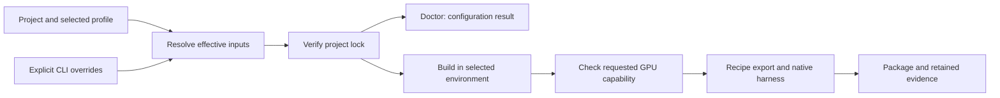

# Model build projects

A `model-build.json` file stores the model, checkpoint and execution settings
that would otherwise be repeated on the command line. Both the checkout launcher
and the installed `physicsnemo-model-builder` command support projects.

There are two supported project formats:

| Format | Starting point | Commands |
| --- | --- | --- |
| `format_version: 1` | A bundled recipe or an external explicit recipe. | `doctor` and `build`. |
| `format_version: 2` | Your Python model and weights, initialized with two editable files. | `init`, `doctor`, eager `check`, and `build`. |

For a new custom model, follow [Add your model](add-model.md). `init` does not
require a checkpoint argument: fill in its path and the environment in
`model-build.json` later. The generated `build_adapter.py` supplies
`create_model(config, assets)` and `create_cases(config, assets)`. Format 2
captures declared Python sources and infers tensor metadata; it generates the
recipe internally. `config` can be an inline object or a JSON file path.

Export, compilation, native inference and parity still use the shared builder
and existing gates. Format-1 projects can select bundled or explicit recipes.

## Start with a GeoTransolver checkpoint

Copy the [GeoTransolver template](../examples/README.md#geotransolver), then use
the generic checkpoint importer. The template has only `model-build.json` and
`adapter.py`; it selects imported configuration and weights under `weights/`
and the SDK's exact TensorRT libraries under `assets/tensorrt/`:

```bash
SDK_ROOT=/path/to/matching/sdk
cp -R native-inference/examples/geotransolver-surface-core /data/my-geotransolver
mkdir -p /data/my-geotransolver/assets/tensorrt
cp "$SDK_ROOT"/lib/libpnmir_tensorrt_exact_*_plugin.so /data/my-geotransolver/assets/tensorrt/
physicsnemo-model-builder import-checkpoint /data/GeoTransolver.0.501.mdlus \
  --project /data/my-geotransolver --output /data/my-geotransolver/weights --json
physicsnemo-model-builder check /data/my-geotransolver --json
physicsnemo-model-builder build /data/my-geotransolver \
  --runtime "$SDK_ROOT/bin/physicsnemo-infer" --json
```

Choose a fresh project directory, download the trusted checkpoint separately,
and use the [compatible environment](geotransolver-workflow.md#checkpoint-and-environment).
The importer creates `weights/config.json`, `weights/checkpoint.pt` and
`weights/import.json`. The template already points to these paths and defaults
to local CUDA execution with AOTI and TensorRT. Use an AOTI-enabled SDK built
with `PNMIR_ENABLE_TENSORRT=ON` and `PNMIR_ENABLE_TENSORRT_EXACT=ON`; see
[building the exact plugins](../cpp-runtime/README.md#exact-tensorrt-operators-for-transolver-and-geotransolver).
The ten copied libraries are declared assets whose hashes enter the project lock.

The adapter creates three deterministic synthetic core-input cases with 32
points. `check` runs the cached core eagerly; `build` compiles it and requires
C++ parity against those eager results. TensorRT uses `geotransolver-exact-v2`,
which automatically freezes scalar parameter sigmoid gates before ONNX conversion
and requires byte-identical outputs. AOTI uses `aten-boundary-exact-v2`.
There are no model-specific fixture
assets or preparation steps. This example does not qualify full geometry
processing or physical CFD accuracy; see its
[input contract and scope](geotransolver-workflow.md#cached-core-inputs-and-scope).

The normal settings below apply to execution profiles, a different compatible
runtime or an immutable container image. GeoTransolver is external to the
builder and uses a format-2 project rather than a built-in model name.

## Select a custom recipe

A project can instead reference the existing format-2 recipe for a custom
model. Exactly one of `model` and `recipe` is required:

```json
{
  "format_version": 1,
  "recipe": "recipe/recipe.json",
  "config": "model-config.json",
  "checkpoint": "weights/trained.pt",
  "assets": {"normalization": "data/normalization.json"},
  "builder_image": "sha256:<development-image-id>",
  "backends": ["aoti"],
  "device": "cuda",
  "output_root": "builds"
}
```

The recipe still declares the Python adapter, tensor contracts and verification
cases. The selected checkpoint must be a plain tensor state dictionary; the
builder strictly loads it into the constructed model. Assets must be declared
by the recipe. See the [working configured-affine example](../examples/README.md#configured-affine)
and [model-input contract](model-inputs.md).

Python dependencies belong in the selected builder environment. This explicit
recipe path retains the recipe's adapter and declared data files. To capture
your local model modules automatically, use a [format-2 authoring project](add-model.md)
and its `source` selection instead. Neither project format installs dependencies
or generates a new Docker image.

## Settings and profiles

Resolution order is project settings, selected profile, then explicit CLI
arguments. `--profile NAME` takes precedence over `default_profile`. Unknown
fields, profiles, duplicate JSON keys and non-finite JSON numbers fail before
execution.

| Setting | Behavior |
| --- | --- |
| Paths in `model-build.json` | Relative to that file's directory, including profile paths. |
| Explicit CLI paths | Relative to the caller's current directory. |
| `backends` / repeated `--backend` | Replace the previous backend list. |
| `assets` / repeated `--asset NAME=FILE` | Override individual declared assets by name. |
| `config` / `--config` | Select a whole configuration file; dictionaries are not merged. |
| `aoti_options` (format 2) | Select supported boolean compiler controls. A profile's whole object replaces the project's object; `{}` clears inherited overrides. |
| `output_root` | Create a fresh, uniquely named build directory below this path during execution. |
| `--output` | Select a particular fresh output directory instead. |
| `required_gpu_arch` | Require `sm` followed by two or three digits, such as `sm90` or `sm100`; requires a CUDA device. |

Profiles may change `executor`, `builder_image`, `runtime`, `toolchain_lock`,
`device`, `required_gpu_arch`, `backends` and `output_root`. They cannot change
model selection, checkpoint, configuration, assets or recipe tensor contracts.
Use a separate project or an explicit input override for a different exported
workload.

These execution profiles also apply to format-2 authoring projects. Their
`config` may be an inline JSON object; `--config` replaces it with a selected
file. Format-2 profiles additionally allow `aoti_profile`, `aoti_options`, and
`tensorrt_profile`. Profiles cannot change `source`, adapter, model identity or
tensor names. Format-1 project profiles retain their execution-only settings;
an explicit recipe supplies its compiler selection.

| TensorRT profile | Required plugin assets | Native acceptance |
| --- | --- | --- |
| `baseline` (default) | None. | Existing numerical parity limits. |
| `layout-order-exact` | Eight exact plugins for the supported Transolver graph. | Existing numerical parity limits. |
| `geotransolver-exact` | Those eight plugins plus WeightedBlend. | Byte-identical eager/C++ outputs for every case. |
| `geotransolver-exact-v2` | The nine GeoTransolver plugins plus DesliceBmm. | Byte-identical eager/C++ outputs for every case, preserving deslicing layout after attention mixing. |
| `domino-surface-exact` | Linear, GELU, ScalarDiv and InverseDistanceBlend. | Byte-identical eager/C++ outputs for every case. |

GeoTransolver's profile also selects `FreezeScalarSigmoidGates` automatically;
customers do not add that pass to the adapter. Profile selection and captured
plugin identities are locked inputs. See [TensorRT profiles and assets](add-model.md#tensorrt-profiles)
for the asset declarations and [GeoTransolver behavior](geotransolver-workflow.md#build-checks-and-outputs)
for the exactness checks. The Transolver profile retains its eight-plugin contract.
The [DoMINO example](domino-workflow.md) pairs its surface TensorRT profile with
`aten-boundary-exact-v3` and a declared AOTI sidecar; both backends require
byte-identical core outputs.

The default executor is `container` and the default device is `cuda`. To use
an existing qualified Python/CUDA environment, select `"executor": "local"`
and `"runtime": "/path/to/sdk/bin/physicsnemo-infer"`. Local execution requires the model
dependencies and compatible native SDK; the launcher does not compile an SDK
automatically. A local authoring `check` does not need the native runtime;
`build` does.

### AOTI options in format-2 profiles

Keep one model, checkpoint, and validation set while comparing AOTI compiler
selections. Merge this fragment into a complete format-2 project:

```json
{
  "default_profile": "accuracy",
  "profiles": {
    "accuracy": {
      "aoti_profile": "aten-boundary-exact-v2",
      "aoti_options": {
        "max_autotune": false,
        "epilogue_fusion": false,
        "shape_padding": false,
        "coordinate_descent_tuning": false
      }
    },
    "standard": {
      "aoti_profile": "baseline",
      "aoti_options": {}
    },
    "autotune": {
      "aoti_profile": "baseline",
      "aoti_options": {"max_autotune": true, "epilogue_fusion": true}
    },
    "autotune-no-fusion": {
      "aoti_profile": "baseline",
      "aoti_options": {"max_autotune": true, "epilogue_fusion": false}
    }
  }
}
```

The profile names here are user-defined. `standard` retains installed compiler
defaults, which may already enable some optimizations. `accuracy` explicitly
disables all four exposed controls in addition to selecting the existing exact
profile. None of these names guarantees an accuracy or speed result for a new
model; successful builds still require every supplied case to pass parity.

`aoti_options` accepts only boolean `max_autotune`, `epilogue_fusion`,
`shape_padding`, and `coordinate_descent_tuning` fields. Unknown keys and
non-boolean values are rejected. Explicit `epilogue_fusion: true` requires
explicit `max_autotune: true` in the same resolved object. The exact
`aten-boundary-exact-v2` profile permits only `false` option values. A missing
Torch compiler control causes an error instead of silently ignoring the
request. See [AOTI option details](add-model.md#optional-export-compatibility).

A selected profile inherits `aoti_options` only when it omits the field. If it
supplies an object, that object replaces the whole inherited map. For example,
a profile containing only `{"epilogue_fusion": true}` cannot inherit a
top-level `max_autotune: true`; it must specify both keys. An empty object
selects no explicit overrides. Compiler `mode` strings are not supported.

Build each selection into a fresh output directory:

```bash
for profile in accuracy standard autotune autotune-no-fusion; do
  physicsnemo-model-builder build /data/my-model --profile "$profile" \
    --output "/data/aoti-comparison/$profile" --json
done
```

Each profile has a separate `build:<profile>` lock entry. Changing a selected
compiler profile or options for an existing entry requires `--update-lock`.
Changing only the fresh output path does not. Inspect the retained
`project/effective-config.json`, generated recipe, and package metadata to see
what was selected.

For nonempty options, `model/backends/aoti/model.json` records
`artifacts[0].compiler_options` with requested/applied maps, effective values of
the four supported controls, and compiler versions. The named
`correctness_profile` is independent. Compare each `checks/aoti.json` against
the same cases and limits before timing the compiled packages. The
[runnable MLP example](../examples/README.md#aoti-profiles) includes these
profiles and preparation commands. No automatic latency or GPU-memory
comparison report is produced by selecting a profile.

## Lock the selected build inputs

The first build records its selected input and toolchain identities in
`model-build.lock.json` beside the project file. Entries are separate for each
build profile, for example `build:h100` and `build:a10g`; a project without a
profile uses `build`. A profile named `default` has its own `build:default`
entry and remains distinct from an unprofiled selection.

On later runs, a changed selection for an existing entry fails before model
execution. This includes changed source/checkpoint bytes, backend/device
selection and builder/runtime identity. Selecting a fresh output directory
does not require changing the lock.

When intentionally changing the selected inputs, update that entry explicitly:

```bash
./native-inference/physicsnemo-model-builder build /data/my-model \
  --profile accuracy --update-lock --json
```

`--update-lock` is supported with `build`. `doctor` is read-only
and rejects that option. The lock describes selected build inputs; it is not
a successful qualification report. A failed execution can still leave its
input selection locked for a subsequent attempt.

Format-2 authoring projects publish locks only for `build`, including the
captured source files, checkpoint, assets, configuration and execution identity.
Their `check` and `doctor` commands do not publish locks or accept
`--update-lock`; run `build` to enforce or update the existing build selection.

The build output retains the project, effective settings and selected lock
alongside the build receipt:

```text
<output>/
  project/
    model-build.json
    effective-config.json
    model-build.lock.json
  execution.json
  build.json
```

See the [package contract](packages.md) for compiled artifacts and parity
evidence. The GeoTransolver authoring project uses the same generic
build layout. The deployable `model/` directory remains independent of the
authoring project and checkpoint.

## Use structured results from scripts and coding agents

`init`, `doctor`, `check` and `build` accept `--json`. Stdout contains one result
object with `schema_version: 1`, the command and status. After successful
configuration resolution it also identifies the executor, backends, device and
selected output. Project results include the profile and effective configuration:
resolved recipe defaults, backends, runtime or image, and toolchain. Early
failures may have no resolved configuration or output path.
Framework/container output is separated from the JSON result. Results index the
existing evidence; check the build and qualification reports for their details.

Failures include `diagnostics` entries with a stable `code` and readable
`message`. Current codes are `INVALID_ARGUMENT`, `INVALID_PROJECT`,
`PROJECT_LOCK_MISMATCH` and `BUILD_FAILED`. In JSON mode, exit code 0 means the
requested operation succeeded; 2 indicates invalid arguments/configuration,
including a lock mismatch; 1 indicates failed execution or verification.
For a failed child process, its diagnostic entry's `exit_code` and
`execution.json` preserve its original exit code. Commands without `--json` retain the existing
behavior of returning a child process's exit code directly.

Use discovery already supplied by the CLI:

```bash
./native-inference/physicsnemo-model-builder list --json
```

Project scaffolding (`init`) and eager `check` are implemented for format-2
authoring projects. Initialization returns `status: "initialized"`, created
file paths and next steps. Incomplete authoring settings return `status:
"incomplete"` with field-specific diagnostics. Successful eager checks return
`status: "checked"`, inferred tensor contracts, case count and report paths;
`MODEL_CHECK_FAILED` identifies execution failures. Richer discovery, remote
job scheduling and artifact publication remain future work. Build success
continues to require all requested export, native parity and applicable
workflow qualification gates.


