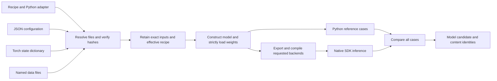

# Model configuration and checkpoint inputs

Recipe format 2 declares configuration, a plain tensor state dictionary and
named data assets; format 1 keeps its zero-argument factory contract. Both use
static float32 tensors with the builder's AOTI/TensorRT backends. Remote weight
downloads, arbitrary pickled models, dynamic shapes and complete CFD pipelines
are outside this input contract. A [model build project](model-build-projects.md)
can store the same file selections for repeated builds.

## Contract

A format-2 recipe adds these fields to the existing model identity, adapter,
factory/cases names and tensor/backend declarations:

```json
{
  "config": {"path": "config.json"},
  "checkpoint": {"format": "torch-state-dict"},
  "assets": {
    "normalization": {"path": "normalization.json"}
  }
}
```

`config` and `checkpoint` are required objects; an omitted `path` requires the
corresponding CLI input. Assets are optional named regular files, each with a
default recipe-relative path. File descriptors may supply a `sha256` pin.
Recipe-relative paths must stay inside the recipe directory and cannot traverse
symlinks. Selected input files must be regular files, not symlinks. Explicit
paths normalize parent directory aliases such as macOS `/tmp`. Configuration
is a JSON object; duplicate keys and nonfinite values are rejected.

CLI overrides are `--config FILE`, `--checkpoint FILE`,
`--checkpoint-sha256 SHA256`, and repeated `--asset NAME=FILE`. They replace
whole files; configuration dictionaries are not merged. Explicit overrides
may live outside the recipe directory. A recipe hash pins its default file;
an override receives a new recorded identity, with an optional explicit
checkpoint pin. Unknown asset names and format-1 input overrides fail clearly.

The callbacks for format 2 are `create_model(config, assets)` and
`create_cases(config, assets)`. `config` is a separate deep copy of the
resolved JSON object for each callback, and `assets` maps declared names to
retained file paths. The worker constructs the model on CPU, reads a plain
PyTorch state dictionary with `weights_only=True`, checks exact keys, shapes
and dtypes, then loads it strictly before moving to the requested device or
evaluating reference cases. Format 1 continues to call zero-argument factories.

The worker retains the original recipe/adapter, copied config/checkpoint/assets,
canonical effective configuration and an effective recipe with relative paths
and resolved hashes. Export and verification use those retained inputs.
Callbacks must treat retained data files as read-only. The worker verifies
retained source hashes after model preparation and again before completing the
candidate, so preparation or compilation cannot silently change its inputs.
`model-inputs/` is reserved below the retained source directory and cannot
contain the recipe's adapter. Declared assets are data passed to callbacks;
Python helper modules are not automatically imported or installed.

The adapter remains trusted Python code supplied by the model producer.
`weights_only=True` avoids loading a pickled model; it does not sandbox the
adapter. Training checkpoints containing optimizer state or a wrapper such
as `{"state_dict": ...}` must first be converted to the model's plain state
dictionary in the producer's trusted Python environment.

Build receipts identify input paths, origins, hashes and sizes. The deployable
model inventory records content identities and effective configuration identity,
without requiring producer file paths. The container frontend stages the same
input bytes read-only, passes explicit paths and checkpoint hash to the inner
local worker, and checks that its completed provenance matches the requested
inputs and the actual retained file bytes. Output model stages must run after
the original files are removed.



## Tensors with different shapes

Format 2 also supports an explicit contract for every input and output. Use
this form for model stages with independently shaped feature, context and
prediction tensors:

```json
{
  "inputs": [
    {"name": "local", "dtype": "float32", "shape": [1, 32, 6]},
    {"name": "context", "dtype": "float32", "shape": [1, 8, 128, 224]}
  ],
  "outputs": [
    {"name": "fields", "dtype": "float32", "shape": [1, 32, 4]}
  ]
}
```

This example illustrates the schema; each adapter supplies its complete model
signature. Declare both arrays and omit the legacy `input_names`,
`output_names`, `dtype` and `shape` fields. Mixing the two forms is an error.
Names are unique within each array and their order defines the adapter's
argument/output order. Only float32 tensors and positive static dimensions
are supported by the current recipe contract. The existing shared-shape shorthand remains
available in formats 1 and 2.

The worker checks input shapes and dtypes before eager inference and checks
declared output shapes and dtypes before export. Container completion also
requires the package manifest and native output metadata to agree with the
requested contract. Legacy output shapes continue to be inferred from the
Python references.

## AOTI compilation profile

An optional `"aoti_profile": "aten-boundary-exact-v2"` selects the compiler
profile used by the GeoTransolver cached-core example. Omit it, or use `"baseline"`,
to retain the existing compiler behavior. These are the only accepted names;
unknown values fail recipe validation without importing Torch. This field
applies only to AOTInductor variants.

Exact mode preserves ATen arithmetic and parameter-linear boundaries. It
requires all of its private Torch compiler controls; a missing control fails
the build instead of silently omitting part of the profile. Compiler settings
are scoped to the export and restored afterward, including on failure. Builds
remain serial within a process because those compiler settings are global.

The compiled artifact's `correctness_profile` metadata identifies the profile,
applied controls, graph pass and producer compiler. Container completion also
checks that a requested exact profile appears in the artifact. Numerical gates
remain unchanged: selecting a profile cannot bypass export or native parity.
Each advertised Torch/GPU combination still needs execution qualification.

## Retained build inputs

```text
source/
  recipe.json                        # producer's original recipe bytes
  export.py                          # adapter, at its recipe-relative path
  effective-recipe.json               # portable paths and resolved hash pins
  model-inputs/
    config.json                      # selected configuration, original bytes
    effective-config.json            # canonical JSON used for identity
    checkpoint.pt                    # selected plain state dictionary
    assets/<name>/<original-name>     # selected named data files
```

`build.json` and `model/model-release.json` record `model_inputs` content
identities. Build evidence also records input origins, while `execution.json`
preserves the host's selections for container execution. Source files are
inventoried with hashes and sizes. Model release identities describe the
inputs used to build a candidate; they do not require those files at inference
time or imply that the candidate has passed scientific CFD qualification.

To repeat a build with the retained inputs, pass
`--recipe /path/to/build/source/effective-recipe.json` and a new output
directory. Select a compatible builder and runtime as for the original build.
Rebuilding repeats export and parity checks; it does not promise bitwise
reproducible compiled binaries across toolchains.

See [configured affine](../examples/README.md#configured-affine) for an
executable authoring project and shared checkpoint preparation tool. The example
lives in the checkout; the installed builder accepts its prepared project
directory. Explicit format-2 recipes remain supported through `--recipe`.

## Verification coverage

The builder tests cover input resolution, malformed/missing data, hash
mismatches, capture, adapter arguments, strict state loading, provenance and
container forwarding. Format-1 recipes retain their regression coverage.
The configured-affine example supplies two checkpoints with independently
computed expected outputs, showing that selected weights affect the result.
Unit substitutes test failure handling; actual native backend execution is
required to establish package parity in a selected toolchain.

See the [package contract](packages.md) for the full candidate/evidence layout
and [builder checks](../model-builder/README.md#development-checks) for local test
commands.
